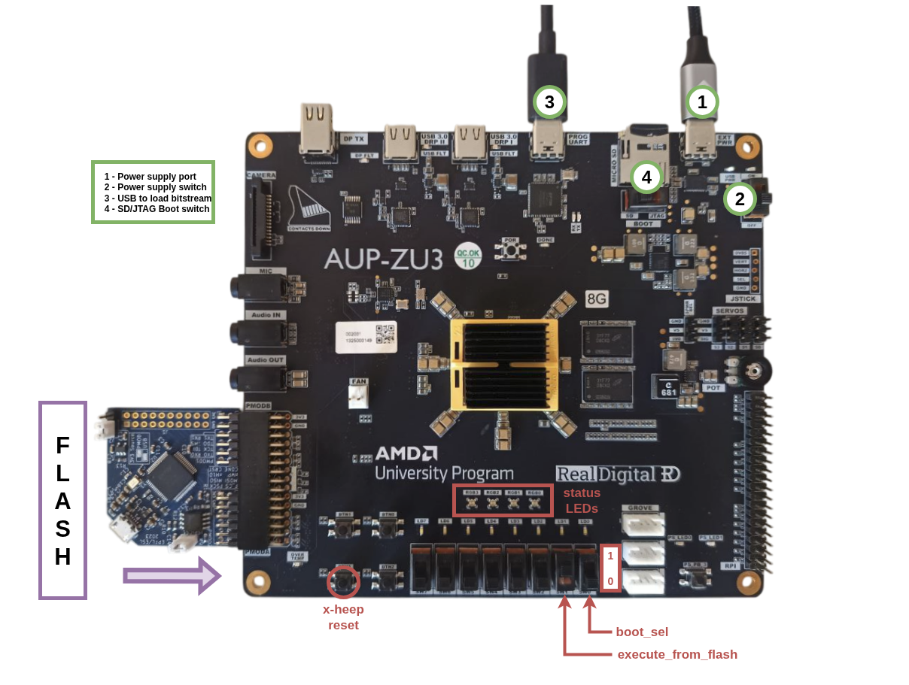

# FPGA AUP-ZU3: Getting Started & Flash Programming Guide

This README provides step-by-step instructions for setting up, debugging, and programming the AUP-ZU3 (8GB) FPGA board. The AUP-ZU3 offers the same capabilities as the TUL Pynq-Z2 board, but with almost twice the logic capacity. 

These instructions assume that you have already generated the bitstream and installed all the required tools. Before proceeding, please refer to the following resources:

- [Bitstream Generation Guide](./RunOnFPGA.md)
- [ICEProg Installation Guide](./../How_to/ProgramFlash.md)

---

## Hardware Connection Steps



1. **Power Up the Board**
   - Connect the power supply as shown in the schematics **(1)**.
   - Turn on the board using the power switch  **(2)**.

2. **Connect USB**
   - Use a USB cable **(3)** to connect your development machine to the board.

3. **Ensure Vivado Board Files Are Installed**
   - Vivado must be able to recognize the AUP-ZU3 board. Ensure the board files are placed in the following directory:
     ```
     <Vivado_Install_Dir>/data/boards/board_files
     ```
   - You can obtain the board files either from:
     - [RealDigital Official AUP-ZU3 Page](https://www.realdigital.org/hardware/aup-zu3)
     - [XHEEP GitHub Repository](https://github.com/x-heep/x-heep)

4. **Connect the Flash**
   - Connect the external flash module to the board as illustrated in the schematics above.

---

## Programming the Board

The steps for programming the board are the same as for pynq board, the only modification you has to do is to change the **TARGET**.

5. **Compile the App and program the flash**
   Refer to the [Compile the Apps Documentation](./../How_to/CompileApps.md)
   ```bash
   make app LINKER=flash_load TARGET=aup-zu3 PROJECT=hello_world
   ```

6. **Program the Flash**
   Programming of the Flash is done in few steps, refer to the figure for the assistance: 
   - Launch the programming with all the switches **off**.
   ```bash 
   make flash-prog
   ```
   - Set the boot switch on the board (4) to **JTAG**.
   - When the device is correctly programmed, the ICEProg tool will show a **non-zero address**.
   - Set the switch back **SD** to boot the software from flash.
   ```bash 
   make flash-prog
   ```


7. **(OPTIONAL: used for DEBUG) Open a Serial Connection (To see printf in the terminal)**
   - You can connect to the board's serial console using `picocom`. Run the following command:
   
   ```bash
   picocom -b 9600 -r -l --imap lfcrlf /dev/serial/by-id/usb-FTDI_Quad_RS232-HS-if02-port0
   ```


---

## Notes
- The APU-ZU3 board is the 8G memory model.
- Refer to the schematics diagram included in the repo for switch and connection references.
- Always make sure the bitstream and Vivado configuration match your hardware revision.

