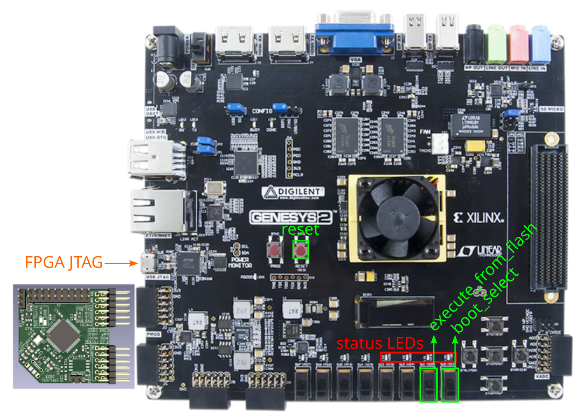

# FPGA Genesys2: Use Guide

This section shows a diagram illustrating how to connect the EPFL X-HEEP programmer to the Genesys2 development board. Although the board provides two PMOD pairs, the programmer must be connected specifically to the interface shown in the image for attaching the external FTDI and flash memory.

The diagram also shows where the X-HEEP global IOs are placed in this board: `reset`, `boot_select`, `execute_from_flash`, and the status LEDs (from left to right: `exit_valid`, `exit_value`, `clk_div`, and `rst_n`).

